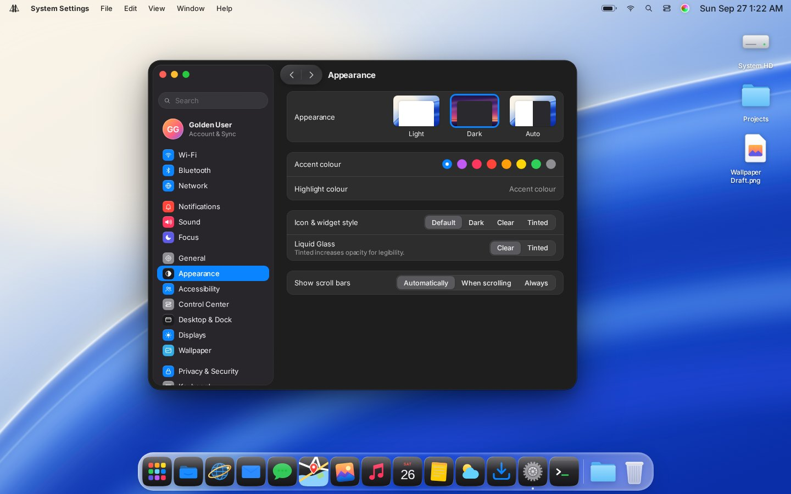

# Golden Gate

A Linux distribution with a Liquid Glass desktop: translucent glass materials,
spring motion, a floating Control Center, a magnifying Dock, Spotlight, and
Finder-style Files, modelled closely on the macOS "Golden Gate" design language
and built entirely from original artwork.


| | |
|---|---|
|  |  |
|  |  |
|  |  |
|  |  |
|  |  |
|  |  |

**The real Linux shell** (Quickshell, captured in a headless Wayland session):

| | |
|---|---|
|  |  |
|  |  |

**The live ISO**, booted in QEMU with plain VGA graphics and no 3D acceleration
(from the automatic boot test that runs after every ISO build):


## What's here

| Layer | Path | Status |
|---|---|---|
| **Design tokens**: materials, colour, type, radii, spring physics | `design/` | Done. One JSON compiles to CSS, QML, GTK and Hyprland config |
| **Icons**: 15 app icons (light + dark), file icons, 115 symbols | `icons/` | Done. Freedesktop theme; [bring your own](icons/custom/README.md) |
| **Reference shell**: the whole desktop and 14 apps, interactive, in the browser | `prototype/` | Done. The spec every other layer is checked against; 25-scenario click-through test in CI |
| **Linux shell**: menu bar, Control Center, Dock, Spotlight, notifications, app switcher, lock screen | `shell/` | Quickshell (QML). Runs in a headless Wayland session (see [Testing](#testing)); not yet run on hardware |
| **Compositor**: blur, squircle corners, springs, key bindings | `compositor/` | Hyprland config done; refraction shader written, plugin pending |
| **App theme**: every GNOME app restyled to macOS metrics (traffic lights, floating sidebar, glass toolbar pills, capsule buttons, Finder tables, Mac menus), light and dark; GTK 3 apps too | `design/gtk/`, `design/dist/gtk*.css` | Done for GTK 4 and GTK 3; per-app passes for Files, Calculator, Settings, Calendar, Terminal |
| **Golden Gate apps**: the apps GNOME can't be restyled into, rebuilt in QML to the macOS 27 layouts: Calculator, Weather (Music, Photos, Notes and Maps next) | `apps/` | Calculator and Weather done and in the image, replacing GNOME's |
| **Theming**: fonts, ⌘ key layer, login screen, boot splash, terminal | `themes/` | Done: fontconfig, keyd, SDDM theme, Plymouth theme, Ghostty |
| **Distro**: bootable live ISO | `distro/archiso/` | Build script done; first ISO build pending (see below) |

## Try it

**In a browser (any OS):**

```sh
npm run dev          # builds tokens + icons, serves prototype/ on :8080
```

Open http://localhost:8080. The session boots, then locks: type any password.
Things to try:

- ⌘/Ctrl-Space for Spotlight (try `12*(3+4)` or an app name)
- right-click anything; right-click or long-press a Control Center button for its details
- Ctrl-↑ for Mission Control, Ctrl-Tab for the app switcher
- hover the Dock; minimise a window with the yellow light, restore it from the Dock
- in Files: Space for Quick Look, Return to rename, ⇧⌘N for a folder, drag onto the Trash
- Settings → Appearance for dark mode, accent colours, icon and glass styles

URL flags reproduce a scene: `?quiet&theme=dark&open=photos,terminal&cc=1`
skips the boot and opens those apps; `?lock` starts at the lock screen.

**On an existing Arch Linux + Hyprland machine:**

```sh
sudo pacman -S hyprland hypridle quickshell qt6-svg qt6-wayland inter-font \
               ttf-jetbrains-mono networkmanager bluez brightnessctl playerctl grim slurp librsvg
scripts/install.sh           # backs up anything it replaces (*.bak-<timestamp>)
sudo scripts/install.sh --extras   # optional (needs keyd, sddm, plymouth): ⌘ layer, login theme, boot splash
```

Then log into Hyprland.

**As a bootable ISO.** The *Build ISO* GitHub Action builds one whenever
`distro/`, the installer or the workflow changes, and attaches it to the run
as the `golden-gate-iso` artifact. On an Arch host:

```sh
sudo pacman -S archiso librsvg nodejs base-devel git
sudo GG_BUILD_AUR=1 distro/archiso/build.sh   # → out/golden-gate-<date>-x86_64.iso
```

`GG_BUILD_AUR=1` builds anything in `packages.extra` that isn't in the official
repositories from the AUR. The live session logs in as `golden` (no password)
and starts the desktop. In a virtual machine, give it 6 GB of memory and 4 CPUs.
QEMU: use `-accel kvm` (Linux) or `-accel whpx` (Windows, after enabling the
Windows Hypervisor Platform feature); `-vga std` works, and
`-device virtio-vga-gl -display gtk,gl=on` adds 3D on Linux. VirtualBox:
VMSVGA graphics; the desktop renders in software there, with or without 3D
acceleration. If VirtualBox shows a green turtle in its status bar, it is running
on top of Hyper-V and everything is many times slower: turn off Hyper-V, Windows
Hypervisor Platform and Memory Integrity, or use QEMU with `-accel whpx`. In a
virtual machine the desktop always runs at 1× scale, and without a GPU it uses
lighter effects (`compositor/hyprland/machine-conf.sh`). If the desktop can't
start, the session drops to a shell that says why.

## Testing

```sh
npm run test:ui       # Playwright clicks through every app and system surface
npm run screenshots   # regenerates docs/screenshots from the prototype
shell/tests/screenshot.sh out/   # runs the real Quickshell shell in headless Sway
design/gtk/tests/app-shots.sh out/   # the GNOME apps with the Golden Gate theme
```

The UI test fails on any page error and checks the flows end to end: boot and
unlock, all 14 apps, Control Center details, Spotlight maths, menus and submenus,
Files (new folder, rename, Quick Look, trash), minimise and restore, Mission
Control, edge tiling, and every appearance combination.

`design/gtk/tests/app-shots.sh out/` runs the ISO's GTK apps with the theme in a
headless Sway session and screenshots each, light and dark, plus a gallery of every
control (`gallery.js`). The *GTK theme* workflow runs it on Arch, the same GTK and
libadwaita as the image, and fails on any CSS the toolkit rejects. It found three
bugs in the image: `GTK_THEME` in the session disabled libadwaita's own stylesheet,
GTK 4.20+ drew our stroked symbolic icons as solid blobs (they are now outlined at
build time), and GNOME Settings refused to start outside GNOME.

The apps in `apps/` are Quickshell configs, one entry file each, sharing the
window frame in `apps/lib` (traffic lights, 52 px toolbar, glass toolbar buttons,
a floating sidebar that Hyprland blurs). Run one on its own with
`qs -p apps/calculator.qml`; the installer copies them to
`/usr/share/golden-gate/apps` with a desktop entry each. Weather uses Open-Meteo
(no API key) and CARTO/OpenStreetMap tiles with RainViewer radar; for offline
work, `apps/weather/tests/make-fixture.py DIR` writes a recorded-format forecast
and `GG_WEATHER_FIXTURE=DIR QML_XHR_ALLOW_FILE_READ=1 qs -p apps/weather.qml`
runs from it.

`shell/tests/screenshot.sh` starts Sway with the pixman renderer and Mesa's
llvmpipe, loads the shell, drives it over IPC and captures the screenshots
above. No GPU needed. Two things this turned up that static checks never would:

- Qt's `BezierEase` keeps at most 8 spline segments; longer curves corrupt the
  heap. The QML springs are fitted with exactly 8.
- Qt's SVG renderer ignores `clip-path`, so the app icons fill their squircle
  through a pattern instead.

## Why a distribution, not a kernel fork

The look and feel of a desktop lives in user space: the compositor, the shell,
toolkit themes, fonts and icons. The Linux kernel doesn't take part. So Golden
Gate stays on the stock Arch kernel and packages and owns everything above them.
That keeps hardware support and security updates coming from upstream for free.
[docs/ARCHITECTURE.md](docs/ARCHITECTURE.md) explains how the layers fit.

## Design

[docs/DESIGN.md](docs/DESIGN.md) is the spec: the three glass materials, the
typography scale, corner radii, and how springs are defined once and reproduced
identically in CSS, QML and the compositor.

## Your own icons

Drop SVG or PNG files into `icons/custom/apps/` (or `places/`, `symbols/`) named
after the icon, e.g. `files.svg`, and run `npm run build`. Your artwork replaces
the built-in icon everywhere: the prototype, the Linux icon theme, and every file
manager that looks up `system-file-manager`, `org.gnome.Nautilus`, and so on.
Details and sizing guidance are in [icons/custom/README.md](icons/custom/README.md).

## Legal notes

- **This build uses Apple's own app icons** (`icons/custom/`, imported with
  `icons/import-icon-pack.sh` from a set exported from macOS 27). Apple licenses
  them for Apple platforms only, so this repository and its ISOs must stay
  private. For anything public, delete `icons/custom/apps*` and rebuild
  (`node icons/build.mjs`): the original Golden Gate icons come back.
- Everything else (symbols, folder icons, wallpapers) is original. SF Symbols and
  SF Pro are not used; the typeface is [Inter](https://rsms.me/inter/) (OFL).
- Recreating a visual *style* is common practice, but Apple's names and logos are
  trademarks. The UI avoids Apple's logo (the menu-bar mark is a bridge tower) and
  uses generic app names (Files, Photos, Web). A few feature names used for
  familiarity, such as *Spotlight* and *Control Center*, and the repository name
  "GoldenApple" should be renamed before any public release.

## Roadmap

See [docs/ROADMAP.md](docs/ROADMAP.md).
