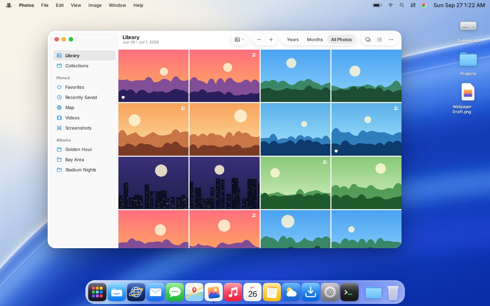
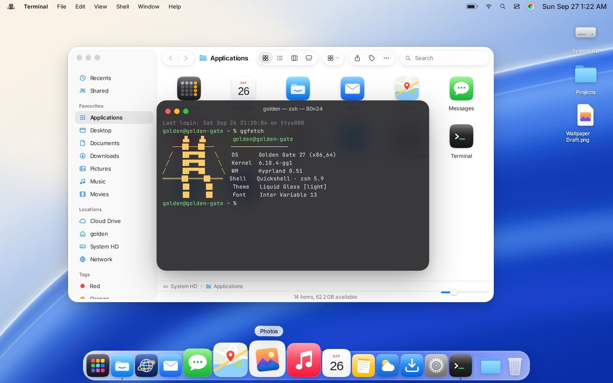

# Golden Gate

A Linux distribution with a Liquid Glass desktop: translucent glass materials,
spring motion, a floating Control Center, a magnifying Dock, Spotlight, and
Finder-style Files, modelled closely on the macOS "Golden Gate" design language
and built entirely from original artwork.


| | |
|---|---|
|  |  |
|  |  |
|  |  |

## What's here

| Layer | Path | Status |
|---|---|---|
| **Design tokens**: materials, colour, type, radii, spring physics | `design/` | Done. One JSON compiles to CSS, QML, GTK and Hyprland config |
| **Icons**: 15 app icons (light + dark), file icons, 63 symbols | `icons/` | Done. Freedesktop theme; [bring your own](icons/custom/README.md) |
| **Reference shell**: the whole desktop, interactive, in the browser | `prototype/` | Done. The pixel spec every other layer is checked against |
| **Linux shell**: menu bar, Control Center, Dock, Spotlight | `shell/` | Written for Quickshell (QML). Syntax-checked, not yet run on hardware |
| **Compositor**: blur, squircle corners, springs, key bindings | `compositor/` | Hyprland config done; refraction shader written, plugin pending |
| **Theming**: GTK 4 / libadwaita, fonts | `design/dist/gtk.css`, `themes/` | Done |
| **Distro**: bootable live ISO | `distro/archiso/` | Build script done; first ISO build pending (see below) |

## Try it

**In a browser (any OS):**

```sh
npm run dev          # builds tokens + icons, serves prototype/ on :8080
```

Open http://localhost:8080. Useful things to try:

- ⌘/Ctrl-Space for Spotlight
- right-click anything
- the Control Center button in the menu bar
- hover the Dock
- double-click a photo
- the yellow light to minimise
- Settings → Appearance for dark mode and accent colours

URL flags such as `?theme=dark&open=photos,terminal&cc=1` reproduce a scene.

**On an existing Arch Linux + Hyprland machine:**

```sh
sudo pacman -S hyprland hyprpaper hypridle quickshell qt6-svg inter-font ttf-jetbrains-mono \
               networkmanager bluez brightnessctl playerctl mako grim slurp librsvg
scripts/install.sh   # backs up anything it replaces (*.bak-<timestamp>)
```

Then log into Hyprland.

**As a bootable ISO** (Arch host, or run the *Build ISO* GitHub Action):

```sh
sudo pacman -S archiso librsvg nodejs
sudo distro/archiso/build.sh     # → out/golden-gate-<date>-x86_64.iso
```

The live session logs in as `golden` and starts the desktop automatically.

## Why a distribution, not a kernel fork

The look and feel of a desktop lives in user space: the compositor, the shell,
toolkit themes, fonts and icons. The Linux kernel doesn't take part. So Golden
Gate stays on the stock Arch kernel and packages and owns everything above them.
That keeps hardware support and security updates coming from upstream for free.
[docs/ARCHITECTURE.md](docs/ARCHITECTURE.md) explains how the layers fit.

## Design

[docs/DESIGN.md](docs/DESIGN.md) is the spec: the three glass materials, the
typography scale, corner radii, and how springs are defined once and reproduced
identically in CSS, QML and the compositor.

## Your own icons

Drop SVG or PNG files into `icons/custom/apps/` (or `places/`, `symbols/`) named
after the icon, e.g. `files.svg`, and run `npm run build`. Your artwork replaces
the built-in icon everywhere: the prototype, the Linux icon theme, and every file
manager that looks up `system-file-manager`, `org.gnome.Nautilus`, and so on.
Details and sizing guidance are in [icons/custom/README.md](icons/custom/README.md).

## Legal notes

- All artwork here (icons, symbols, wallpapers) is original. Apple's icons,
  SF Symbols and SF Pro are licensed for Apple platforms only, so they can't ship
  in a Linux distribution. The typeface is [Inter](https://rsms.me/inter/) (OFL).
- Recreating a visual *style* is common practice, but Apple's names and logos are
  trademarks. The UI avoids Apple's logo (the menu-bar mark is a bridge tower) and
  uses generic app names (Files, Photos, Web). A few feature names used for
  familiarity, such as *Spotlight* and *Control Center*, and the repository name
  "GoldenApple" should be renamed before any public release.

## Roadmap

See [docs/ROADMAP.md](docs/ROADMAP.md).
