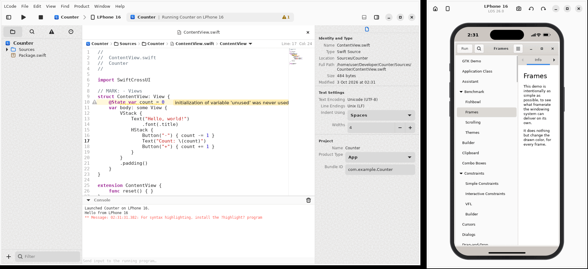

# LCode

An Apple-style IDE for Swift on Linux, built for Arch Linux. LCode follows the
layout and workflow of Apple's IDE: navigators on the left, a tabbed source
editor with a jump bar, a debug console, inspectors on the right, schemes and
run destinations in the toolbar, and a **device Simulator** that runs the apps
you build inside a phone or tablet frame.



## What the Simulator runs

Real iOS apps can't run on Linux. They link against Apple's closed frameworks
(UIKit, SwiftUI, Foundation on Darwin), Apple's SDK license only allows them on
Apple hardware, and there is no open-source emulator for modern iOS. So LCode
compiles your project **for Linux** with the real Swift toolchain, and its
Simulator runs that Linux build on a virtual device.

The App template uses [SwiftCrossUI](https://github.com/moreSwift/swift-cross-ui),
a SwiftUI-style framework (`@State`, `VStack`, `Button`, `WindowGroup`…) that
renders with GTK on Linux. Any X11 or GTK program works in the Simulator, so you
can also bring your own UI library.

## Features

- **Welcome window**: create a project, clone a Git repository, open an existing
  one, and see recent projects.
- **Project templates**: App (SwiftCrossUI), Command Line Tool, and Swift
  Package, with optional unit tests and a Git repository. They set the product
  name, organization identifier and bundle identifier.
- **Navigators**:
  - **Project**: a live file tree, with a filter and context menu (new file or
    folder, rename, move to Trash, show in Files).
  - **Find**: search across the whole project.
  - **Issues**: errors and warnings grouped by file.
  - **Reports**: logs from every build, test and clean.
- **Source editor**:
  - Tabs, syntax highlighting, and Xcode-like light and dark color schemes.
  - Line numbers, current-line highlight, a minimap, and bracket matching.
  - Word completion, find and replace, comment toggling (Ctrl+/), and Go to Line.
- **Jump bar**: breadcrumbs for the project, folders, file and the current
  symbol. Each crumb opens a menu of its siblings or the file's symbols.
- **Inline issues**: compiler errors and warnings show as gutter icons, squiggly
  underlines and message banners on the line.
- **Build, Run, Test, Clean** through SwiftPM:
  - The activity view shows live progress and issue counts.
  - All files are saved before a build, and a failed build opens the first error.
- **Run destinations**: *My Linux PC* runs the program in the console, with
  stdin from the console's input field. Any simulated device runs it in the
  Simulator.
- **Simulator**:
  - Five devices: LPhone 16, LPhone 16 Pro Max, LPhone SE, LPad Air 11-inch and
    LPad Pro 13-inch.
  - A live status bar, camera cutout, home indicator or home button.
  - Rotation (the app gets the new size), a home screen of installed apps,
    screenshots, and "Erase All Content and Settings".
  - Touch, scroll and keyboard input go to the app.
- **Inspectors**: file identity and type, per-file indentation, and project
  product type and bundle identifier.
- **Open Quickly** (Shift+Ctrl+O) for fuzzy file search.
- **Settings**: appearance, editor font and size, indentation, minimap, default
  simulator, and Swift toolchain location.

## Installing on Arch Linux

```sh
sudo pacman -S --needed base-devel rust gtk4 libadwaita gtksourceview5 librsvg xorg-server-xvfb git
git clone https://github.com/mobilaunch/goldenapple.git lcode
cd lcode/packaging/arch
makepkg -si
```

This installs `lcode`, its desktop entry and its icon. To run it from the
source tree instead, use `cargo run --release`.

### Swift toolchain

LCode needs a Swift toolchain to build projects. On Arch, install one from the
AUR (for example `yay -S swift-bin`) or with
[swiftly](https://www.swift.org/install/). LCode looks for `swift` in this order:

1. The path set in **LCode ▸ Settings ▸ Locations**.
2. The `LCODE_SWIFT` environment variable.
3. `swift` on your `PATH`.

## Keyboard shortcuts

Apple's ⌘ shortcuts are mapped to Ctrl. **Help ▸ Keyboard Shortcuts** lists them all.

| Action | Shortcut | Action | Shortcut |
|---|---|---|---|
| Run | Ctrl+R | Open Quickly | Shift+Ctrl+O |
| Build | Ctrl+B | Find in Project | Shift+Ctrl+F |
| Test | Ctrl+U | Find | Ctrl+F |
| Stop | Ctrl+. | Comment Selection | Ctrl+/ |
| Clean Build Folder | Shift+Ctrl+K | Go to Line | Ctrl+L |
| Show/Hide Navigator | Ctrl+0 | Project / Find / Issue / Report navigator | Ctrl+1 / 4 / 5 / 9 |
| Show/Hide Debug Area | Shift+Ctrl+Y | Show/Hide Inspectors | Ctrl+Alt+0 |
| New File | Ctrl+N | New Project | Shift+Ctrl+N |

In the Simulator: Home is Shift+Ctrl+H, Rotate is Ctrl+Left/Right, and Save
Screen is Ctrl+S.

## Projects

An LCode project is a Swift package: a folder with a `Package.swift`. Executable
products become **schemes**. LCode keeps its own data in `.lcode/`:

- `.lcode/project.json`: product type, bundle identifier and default run
  destination. Commit this file.
- `.lcode/userdata/`: per-user window state. Templates add it to `.gitignore`.

You can open any existing Swift package as well.

## How the Simulator works

Each simulated device gets its own headless X server (Xvfb):

1. LCode launches your app on that display. It sets `LCODE_SIMULATOR=1`,
   `LCODE_DEVICE_ID` and `LCODE_DEVICE_NAME`, and asks GTK for software rendering.
2. LCode acts as the window manager. It pins the app's window to the device's
   safe area, the screen minus the status bar and home indicator. The display
   is square, so rotating only resizes the app's window.
3. A capture thread streams the app's pixels into the device frame at about 30
   fps, skipping frames that haven't changed. The status bar and home indicator
   take their tint from the edges of the app.
4. Clicks, drags, scrolling and key presses are sent to the app through the
   XTEST extension.

Your app needs no special code. The Simulator display is independent of your
desktop session; it only needs `xorg-server-xvfb` installed.

## Development

```sh
cargo build
cargo test
cargo clippy
```

| Path | Contents |
|---|---|
| `src/main.rs` | Application setup and app-wide actions |
| `src/welcome.rs`, `src/new_project.rs` | Welcome window and new project assistant |
| `src/workspace/` | Workspace window: navigators, editor, console, inspector, activity view, build pipeline |
| `src/simulator/` | Device catalog, drawing, and the virtual display (Xvfb, capture, input) |
| `src/diagnostics.rs` | Parsing compiler output into issues |
| `src/templates.rs`, `src/project.rs` | Project templates and the project model |
| `data/` | Editor color schemes, icons and the desktop entry |

### Roadmap

- Code completion, jump to definition and Quick Help through `sourcekit-lsp`.
- An LLDB debugger with breakpoints, a variables view and stepping.
- A Source Control navigator, with blame and diffs in the editor.
- A Test navigator with per-test results.
- Live previews for SwiftCrossUI views.

## Trademarks

LCode is an independent project. It is not affiliated with or endorsed by
Apple Inc. Xcode, iPhone, iPad and Swift are trademarks of Apple Inc. The
simulated device names (LPhone, LPad, LOS) are fictional.
