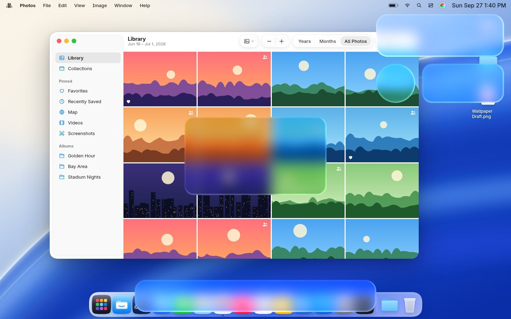

# Liquid Glass in the compositor

Blur alone produces frosted glass. The Golden Gate material also bends the
backdrop near its rim like a lens and catches light along the edge. On Linux,
only the compositor can see the pixels behind a surface, so that part has to
live in Hyprland.



## Today (works now)

`compositor/hyprland/hyprland.conf` enables Hyprland's blur on the shell's layer
surfaces (`gg-dock`, `gg-controlcenter`, `gg-spotlight`, `gg-menubar`).
`ignore_alpha` keeps the blur to the painted glass shapes. The shell
(`shell/components/Glass.qml`) paints the tint, rim and light catch on top.
The result is the full "regular" material without refraction.

## Next: `hyprglass` plugin (planned)

A small Hyprland plugin that:

1. Hooks layer-surface rendering for namespaces matching `^gg-`.
2. Reads the glass shapes (rect + radius) the shell publishes over a tiny IPC
   (`qs ipc` → plugin socket), since one layer can hold several modules.
3. Renders `liquid-glass.frag` over the already-blurred backdrop for each shape.

## The shader

`liquid-glass.frag` (the "ultra" pass) layers several restrained optical
effects over the blurred backdrop, inside a rounded-rect SDF:

- a broad shallow lens plus a stronger bend in the rim, strongest at corners
- multi-tap sampling across the rim for a sense of thickness
- slight chromatic dispersion, confined to the rim
- Fresnel-like grazing light, a directional highlight ribbon and a soft
  catch on the far edge
- the material tint, lighter along the rim than in the body

It is GLSL ES 1.00, so it avoids `fwidth()` (which needs an extension there):
the SDF is in pixels with a unit gradient, so a constant antialiasing width is
equivalent. The browser prototype can't run it, because a web page can't read
the pixels behind an element; `prototype/js/glass.js` approximates the lens
with an SVG displacement map instead (`?refract`).

## Testing

```sh
npm run test:shader                       # compile + render; fails on any GLSL error
npm run test:shader -- my.frag out.png    # try a variant and save a preview
```

`test/render.mjs` compiles the shader in WebGL 1, which is as strict about
GLSL ES 1.00 as the compositor's GLES, and renders it over a blurred desktop
with shapes like the shell's (the image above). CI runs it on every push.
